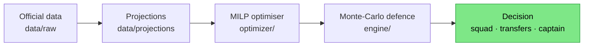

# catenaccio

**A Monte-Carlo + MILP engine for FIFA World Cup 2026 Fantasy — built to _defend a lead_, not chase points.**


-orange)


*Catenaccio* — Helenio Herrera's bolt-the-door defensive system at Inter in the 1960s.
The name is the thesis: once you're ahead, the right objective is no longer expected
points, it's **minimising variance relative to the field**. This repo encodes that —
from squad construction to the captain pick — as an explicit optimisation problem.

---

## What it does

A reproducible pipeline that, each round of the World Cup, decides the optimal fantasy
squad, transfers, captain and bench under the real game constraints:

1. **Ingest** the official open data from `play.fifa.com` (1,485 players, fixed prices,
   live ownership, fixtures, realised points).
2. **Project** expected fantasy points per player, blending bookmaker-implied
   probabilities, expected line-ups and the position-specific scoring rules.
3. **Optimise** with an exact MILP (`scipy.optimize.milp` / HiGHS): squad build at
   MD1, then transfer decisions (0 / free / hit) every round, re-picking XI + captain.
4. **Defend the lead** with a calibrated Monte-Carlo engine that scores decisions by
   `P(stay 1st)` instead of raw EV — the core idea behind the name.

## Track record

Run live since 11 June 2026. Per-round scores in a private mini-league
(see [`results/`](results/)):

| Round | Round pts | Standing      |
|-------|-----------|---------------|
| MD1   | 91        | 1st           |
| MD2   | 94        | 1st (+14)     |
| MD3   | 50        | 2nd (−15)     |

A cold MD3 cost the lead — a low-variance plan only protects a lead if its floor sits
near the field's, and ours didn't. That flips the objective for the knockouts: the
Round-of-32 rebuild stops minimising variance vs the field and starts **maximising it
relative to the specific leader** (the chaser's problem). Same engine, inverted target.

## How it works



- **Squad build (MD1)** — `optimizer/squad_build_md1.py`: exact MILP over ~560 priced
  players. Budget $100m, 2/5/5/3 composition, ≤3 per nation, valid XI, captain doubling,
  and a configurable "≥6 sub-5%-owned starters" differential constraint (with a pure-EV
  comparison mode).
- **Transfers (MD2/MD3)** — `optimizer/transfer_md{2,3}.py`: given the current squad and
  2 free transfers, solve three scenarios (0 / ≤2 free / one −3 hit) and recommend the
  best, defaulting to no hit when leading.
- **Title-defence engine** — `engine/monte_carlo.py`: simulates the round with realistic
  (skewed, bootstrapped) player distributions, **shared captain draws** so your captain
  and rivals' captains are coupled, and each manager's base anchored to realised history.
  Outputs `P(drop from 1st)` per decision. This is what shows that, defending a lead, you
  should captain the field's *modal* premium, not the highest-EV one.
- **Probability calibration** — `engine/calibrate_p4.py`: a logistic model for
  `P(player scores >4)` fit on realised MD1+MD2 data, replacing a hand-set heuristic.
- **Knockout chaser (R32)** — `optimizer/squad_build_r32.py` + `engine/monte_carlo_r32.py`:
  the inverted build. Full $105m rebuild, then a head-to-head simulator that scores each
  captain by `P(overtake the leader)` — with a shared per-nation team shock so co-owned
  players cancel, and an *ensemble over the leader's likely captain* so the pick is robust,
  not assumed. The conclusion: when chasing, captain a premium the leader **can't** own.

## Repository structure

```
catenaccio/
├── data/
│   ├── raw/            official play.fifa.com snapshots (players, squads, rounds)
│   ├── projections/    model output: expected points per player, per round
│   ├── processed/      merged player pool
│   └── source/         original price export
├── optimizer/          exact MILP squad + transfer optimisers (scipy HiGHS)
├── engine/             calibrated Monte-Carlo title-defence engine + p4 model
├── results/            chosen squads & transfer decisions per round
└── docs/               methodology and the external code-audit log
```

## Quickstart

```bash
# Python 3.11+, then:
pip install numpy scipy scikit-learn matplotlib

# build the MD1 squad (pure-EV variant shown)
python optimizer/squad_build_md1.py --no-diff-constraint

# evaluate MD3 transfer scenarios (0 / free / hit)
python optimizer/transfer_md3.py

# (re)fit the scoring-probability model and run the title-defence simulation
python engine/calibrate_p4.py
python engine/monte_carlo.py

# knockout chaser: rebuild the R32 squad ($105m) and pick the captain by P(overtake)
python optimizer/squad_build_r32.py
python engine/monte_carlo_r32.py
```

Scripts resolve paths relative to the repo root, so they run from any directory.

## Data sources

- **play.fifa.com** open JSON endpoints (`players.json`, `squads.json`, `rounds.json`) —
  prices, ownership, fixtures, realised points. No auth required.
- **Bookmaker odds & line-up news** — gathered per fixture to drive projections.
- **Opta / theanalyst.com** — xG cross-checks during analysis.

## Methodology & audit

The approach, assumptions and known limitations are documented in
[`docs/methodology.md`](docs/methodology.md). The codebase was put through an external
adversarial review (twice); the findings and the fixes applied are logged in
[`docs/audit.md`](docs/audit.md) — including a captain-selection bug, a probability
mis-calibration, and the shift from EV-maximisation to `P(stay 1st)`.

## Limitations

Projections are model estimates, not the output of a trained statistical model; the
title-defence simulator currently covers one round at a time and approximates rivals from
ownership priors. See [`docs/methodology.md`](docs/methodology.md) for the full list and the
planned knockout-stage simulator.

## License

MIT — see [`LICENSE`](LICENSE). One caveat: under the **Mordeczki Michała Beer
Amendment (clause 0.5)**, members of the Mordeczki Michała collective who use this
software owe the author at least one (1) beer 🍺. Everyone else gets plain MIT.
